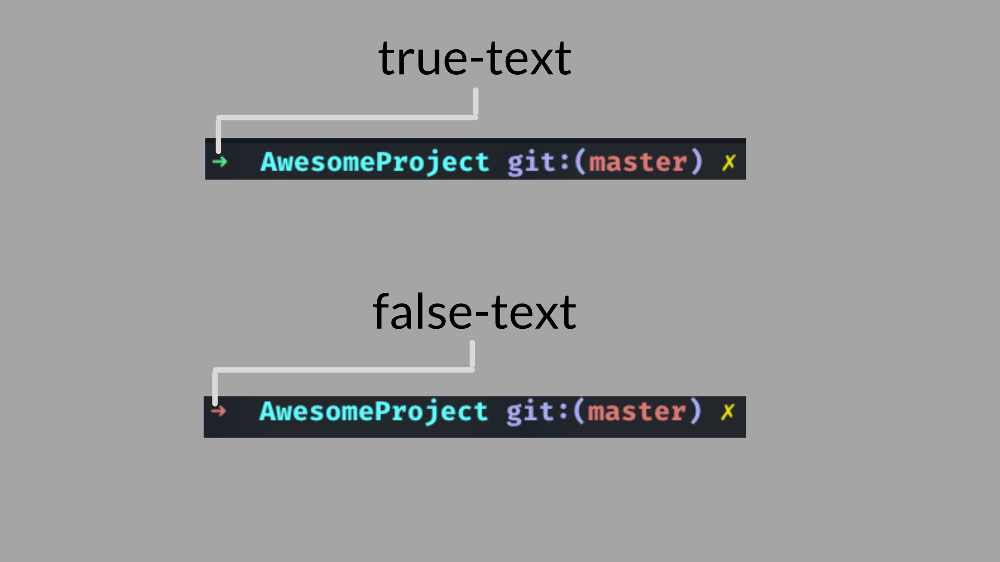
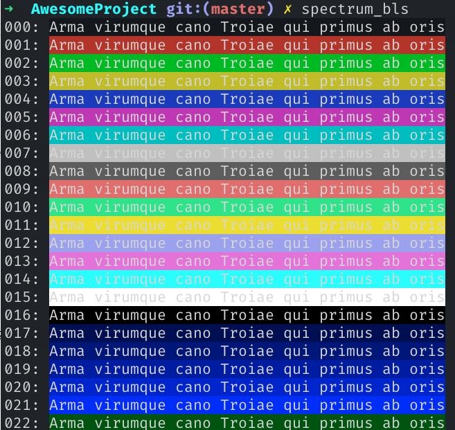

+++
author = "MD. MOHIBUR RAHMAN"
title = " Making a custom zsh theme: for fun and aesthetic. "
date = "2021-05-26"
# description = "Lorem Ipsum Dolor Si Amet"
categories = [
    "Terminals"
]
tags = [
    "Terminal",
    "Cli",
]
# image = "banner.png"
image = "banner.png"
+++

**_TLDR:_**

This article gives an introduction on how to modify the existing zsh theme to one's own liking.  
Source Code: [Github](https://github.com/mrpmohiburrahman/dotfiles/blob/master/ZSH_THEME/mrp.zsh-theme)

Back story:  
As being a React Native Developer I’ve to spend a lot of time looking at my iterm2 terminal emulator. So I decided to make that emulator look prettier.

I am using zsh with my iterm2. So, like any other beginner, I have installed [oh-my-zsh](https://github.com/ohmyzsh/ohmyzsh). oh-my-zsh got many [themes](https://github.com/ohmyzsh/ohmyzsh/tree/master/themes). I am particularly interested in the minimalistic theme [robbyrussell.zsh-theme](https://github.com/ohmyzsh/ohmyzsh/blob/master/themes/robbyrussell.zsh-theme).


I liked the look and feel, it doesn’t bombard me with a bunch of information that according to my preferences I don’t need. Like the full path of my current directory. Don’t get me wrong, many of you may need that information for your workflow but in my case, I don’t need that.  

Although I like the simple approach I want something that I can tell that "this is mine". So I have tried modifying it to my likings. This article describes my journey.

**_Prerequisite:_**  
This article is for those who knows/have

- [zsh](https://github.com/ohmyzsh/ohmyzsh/wiki/Installing-ZSH) installed
- [oh-my-zsh](https://github.com/ohmyzsh/ohmyzsh#basic-installation) installed
- [iterm2](https://iterm2.com/downloads.html) (or any other terminal emulator that supports [24 bit color](https://gist.github.com/XVilka/8346728#now-supporting-true-color) or true color) installed

**_Set up:_**  
After doing the all the things in previous prerequisite section go to the following directory

```zsh
cd .oh-my-zsh/custom/themes/
```

Now create a file with the extension .zsh-theme (in my case I named the file as mrp.zsh-theme) and copy-paste the content of [robbyrussell.zsh-theme](https://github.com/ohmyzsh/ohmyzsh/blob/master/themes/robbyrussell.zsh-theme) to our customer .zsh-theme file.

Now open ~.zshrc file and put the following line

```zsh
ZSH_THEME="mrp"
```

**_PROMPT:_**  


Now let's look at the first line of our [robbyrussell.zsh-theme](https://github.com/ohmyzsh/ohmyzsh/blob/master/themes/robbyrussell.zsh-theme)


Here the prompt follow the following [pattern](https://zsh.sourceforge.io/Doc/Release/Prompt-Expansion.html#Conditional-Substrings-in-Prompts)

```zsh
%(?:true-text:false-text)
```

It specifies a ternary expression. Meaning it checks for condition, if the condition returns true then it will show _‘true-text’_ in the prompt, otherwise it will show _‘false-text’_. Here the condition is specified by the _"?”_ mark, which indicates whether or not the last command was executed successfully. If the last command executes successfully then the true-text will show on prompt, otherwise, the false-text will show.




Now let’s look at our formatting of true-text. Our true-text is divided into two parts. One defines the formatting and color and the other defines actual things to show.

1st part

```zsh
%{$fg_bold[green]%}
```

It follows the following [pattern](https://zsh.sourceforge.io/Doc/Release/Prompt-Expansion.html#Visual-effects)

```zsh
%{...%}
```

We define our colors and the formatting between them. Here, it uses the pattern of [‘colors’](https://github.com/zsh-users/zsh/blob/0c14732cf740149aa906017938624db2e864f08e/Functions/Misc/colors) function that ships with zsh by default.

We can define colors in three ways:

1. We can use named color (used in robbyrussell.zsh-theme) instead of ‘green’ and in place of fg_bold the following settings can be used:

    1. for foreground: fg, fg_bold, and fg_no_bold

    1. for background bg, bg_bold, and bg_no_bold

1. Another way of setting colors is using the following pattern

```zsh
$FG[202]
```

so our code of true-text will be

```zsh
$FG[255]➜
```

oh-my-zsh [uses](https://github.com/ohmyzsh/ohmyzsh/issues/1101#issuecomment-5450278) [Spectrum](https://github.com/ohmyzsh/ohmyzsh/blob/master/lib/spectrum.zsh) under the hood to define the color code 0-255. You can visualize the whole set of color by running the following command

```zsh
spectrum_ls # without background
```


```zsh
spectrum_bls # with background
```



3. However we are using the [third way](https://zsh.sourceforge.io/Doc/Release/Prompt-Expansion.html#Visual-effects) using the following pattern

```zsh
%F{HEX_CODE}
```

iterm2 supports [true color](https://gist.github.com/XVilka/8346728#now-supporting-true-color). So we can use any hex color code. let give the hex color for both true-text and false-text. After that our code for prompt should look like the following

our terminal now looks like the following:  


Now let's change the arrow sign to the apple logo.  
After searching for a long time I’ve finally found the icon. Here is that apple logo.

Now you may not see it here, but just copy-paste that on the prompt code then you’ll the logo on the prompt. After adding the logo our Prompt code should look like the following:


Now our prompt should look like this.  


**_PROMPT+:_**  
Now let’s take a look at the 2nd line of our theme.


There is nothing much to change. we will change some color. First, let’s understand what does it mean:

1. 1st part: which space indicate the spacing from our apple icon to our current directory name
1. 2nd part: `%{$fg[cyan]%}` indicates the color of our current directory. let change it to `%{%F{#46b5d1}`
1. 3rd part: %c indicates that the prompt will only show the last component of the current directory path.
1. 4th part: in short the string `“%{$reset_color”` indicates that the input text will be different than the rest of the prompt like the following:  

1. if you delete `%{$reset_color` then the input text will be just like the rest of the prompt like the following:  
1. 5th part: `$(git_prompt_info)` indicates that the basic info of git SCM of the current directory will show just after a white space from the current directory like the following:

However, the way that git_prompt_info will show us the information is defined by the following code snippet

```zsh
ZSH_THEME_GIT_PROMPT_PREFIX="%{$fg_bold[blue]%}git:(%{$fg[red]%}"
ZSH_THEME_GIT_PROMPT_SUFFIX="%{$reset_color%} "
ZSH_THEME_GIT_PROMPT_DIRTY="%{$fg[blue]%}) %{$fg[yellow]%}✗"

ZSH_THEME_GIT_PROMPT_CLEAN="%{$fg[blue]%})"
```

_ZSH_THEME_GIT_PROMPT_PREFIX_ variable the UI configuration on how the text `git:(` will show. there are 3 parts that this variable contains:

1. `%{$fg_bold[blue]%}` defines the color of the 2nd part (what will actually be showing)
1. `git:(` , this string will actually be showing.
1. `%{$fg[red]%}` defines the color of the branch name. in our case that is the master branch

_ZSH_THEME_GIT_PROMPT_SUFFIX_ variable ensures the input text color is different from the rest of the prompt.  
_ZSH_THEME_GIT_PROMPT_DIRTY_ variable will take effect if the branch is dirty. it contains 4 part

1. `%{$fg[blue]%}` defines the color of 2nd part of 1st bracket
1. `)` 2nd part of that 1st bracket
1. `%{$fg[yellow]%}` define the color the next mark
1. `✗` actual mark that will show when the branch is dirty.

_ZSH_THEME_GIT_PROMPT_CLEAN_ variable defines the rest of the prompt when the branch is clean. it has 2 part

1. `%{$fg[blue]%}` defines the color of the next element
1. `)` actual element to show.

Now let’s make changes in the following places

1. Replace all `%{$fg_bold[blue]%}` and `%{$fg[blue]%}` and `%{$fg[red]%}` to this `%F{#89C9D9}`
1. Replace `git:` to `\ue727 ->` in ZSH_THEME_GIT_PROMPT_PREFIX

After doing all the above your 4 variable related to the git prompt should look like the following

```zsh
ZSH_THEME_GIT_PROMPT_PREFIX="%F{#89C9D9}\ue727 -> (%F{#89C9D9}"
ZSH_THEME_GIT_PROMPT_SUFFIX="%{$reset_color%} "
ZSH_THEME_GIT_PROMPT_DIRTY="%F{#89C9D9}) %{$fg[yellow]%}✗"

ZSH_THEME_GIT_PROMPT_CLEAN="%F{#89C9D9})"
```

Now your prompt with git info should look like the following.  


Now the whole code for our custom prompt should look like the following:

```zsh
PROMPT="%(?:%F{#46b5d1} :%F{#d16246} )"
PROMPT+=' %{$fg[cyan]%}%c%{$reset_color%} $(git_prompt_info)'


ZSH_THEME_GIT_PROMPT_PREFIX="%F{#89C9D9}\ue727 -> (%F{#89C9D9}"

ZSH_THEME_GIT_PROMPT_SUFFIX="%{$reset_color%} "

ZSH_THEME_GIT_PROMPT_DIRTY="%F{#89C9D9}) %{$fg[yellow]%}✗"

ZSH_THEME_GIT_PROMPT_CLEAN="%F{#89C9D9})"
```


That's it for today. If you have any questions feel free to ask.
