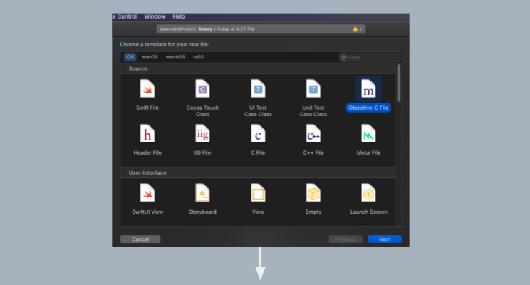

+++
author = "MD. MOHIBUR RAHMAN"
title = "Hacking a React Native Library: The Easy Way"
date = 2021-05-20
description = ""
image = "banner.png"
math = true
series = ["Themes Guide"]
aliases = [""]
categories = []
tags = []
slug=''
+++

## **_TLDR:_**  

This post introduces implementing [(IOS)Native modules](https://www.reactnative.guide/16-custom-native-modules/16.2-ios-native-module.html) with a real-life scenario. Although not mandatory but skimming through the content of this [link](https://www.reactnative.guide/16-custom-native-modules/16.2-ios-native-module.html) will also help you better understand this article. Also, this article is for those who are new to using Native Modules in React Native.  

### Full working project: [GitHub](https://github.com/mrpmohiburrahman/AppTrackingTransparencyImplmentation)

## **_Back story:_**  

Some days ago I was trying to implement asking user permission for App Tracking Transparency(ATT) (tracking the use in terms of providing relevant ads) on IOS. I was using the [react-native-tracking-transparency](https://github.com/mrousavy/react-native-tracking-transparency) library but for some reason, it didn’t work. (probably my fault, that library was working on other projects).

So, I've decided to look into the source code since it should be a simple implementation according to [Apple](https://developer.apple.com/documentation/apptrackingtransparency). Later, I’ve successfully implemented that user permission for ATT using [Native modules](https://www.reactnative.guide/16-custom-native-modules/16.2-ios-native-module.html) and copy-pasting the code from that library.

## **_Do You Need This?_**  

When working with third-party libraries, you may find yourself doing some hacking to make that library work in a specific way that you wanted. Understanding the inner working may help you in the future.

## **_Steps:_**  

There are 5 steps:

1. Create Header file (.h) file.
1. Create Objective-C (.m) file.
1. Comparing files between the files in the library and the file we’ve created.
1. Add strings in info.plist.
1. Access functions of Objective c (.m) file from App.js.

### Step 1: Create Header file ( .h ) file

  


select **Header** file.

  
copy-paste the following code to your _TrackingTransparency.h_ (header file).

```obj-c
#import <React/RCTBridgeModule.h>
@interface TrackingTransparency : NSObject <RCTBridgeModule>
@end
```

### Step 2: Create Objective-C (.m) file

  

  

Select **_Objective-C_**  File

  
  
  

copy-paste the following code to your **_TrackingTransparency.m_** file.

```obj-c
#import "TrackingTransparency.h"
@implementation TrackingTransparency
RCT_EXPORT_MODULE();
@end
```

### Step 3: Comparing files between our TrackingTransparency.m with the libraries own TrackingTransparency.m file

Now take a look at the library. We can see that the library contains an “ios” folder and no android folder which means that this library may contain some native code written on swift or objective C.

In that ios folder we can see two files name _TrackingTransparency.h_ and _TrackingTransparency.m_ which are exactly as we have created just now. let’s compare these 2 files to our files.

1. _TrackingTransparency.h_ on our project and that library are the same.   
1. **_TrackingTransparency.m_** files are almost the same. But that library contains some extra code: one import statement and 3 functions. We will be using 2 functions among them from React Native side using Native modules. Now we need to copy these extra things to our **_TrackingTransparency.m_** file. After copying, our **_TrackingTransparency.m_** will look like the following. 
1. Step 4: Add the following lines in our **_ios/AwesomeProject/Info.plist._**

    ```plist
    <key>NSUserTrackingUsageDescription</key>
    <string>this line will be shown to the user in the pop up when asking for permission</string>
    ```

    
    Caution: If you don't add these strings your app may crash.
1. Now we can easily access the two functions ( _requestTrackingPermission()_ and _getTrackingStatus()_ ) from TrackingTransparency.m using [Native Modules](https://www.reactnative.guide/16-custom-native-modules/16.2-ios-native-module.html). Add the following import statement to your App.js.

```js
import NativeModules from 'react-native';
```

Now we can ask user permission using the following code snippet.

```js
NativeModules.TrackingTransparency.requestTrackingPermission()
```

We can get the current tracking status using the following code snippet.

```js
NativeModules.TrackingTransparency.getTrackingStatus()
```

it will return one of the following string:

1. `denied`: The user has denied permission to track.
1. `authorized`: The user has given permission to track.
1. `restricted`: Authorization to access app-related data that can be used for tracking the user or the device is restricted. source [ATTrackingManager.AuthorizationStatus.restricted](https://developer.apple.com/documentation/apptrackingtransparency/attrackingmanager/authorizationstatus/restricted).
1. `not-determined`: Didn't ask the user to give tracking permission yet. Call requestTrackingPermission().

Side note: if you look at the code here on [react-native-tracking-transparency/src/index.ts](https://github.com/mrousavy/react-native-tracking-transparency/blob/master/src/index.ts), you can see almost the same code where Native Modules was used.

Finally, your App.js should look like this

